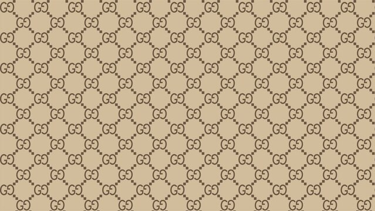
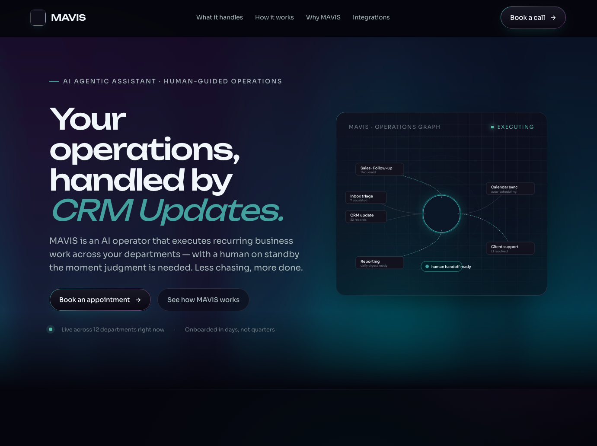
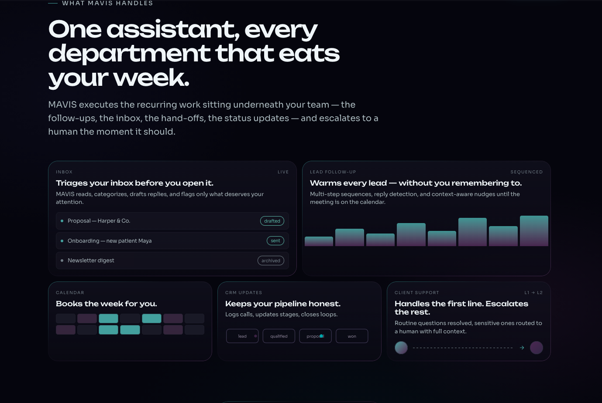
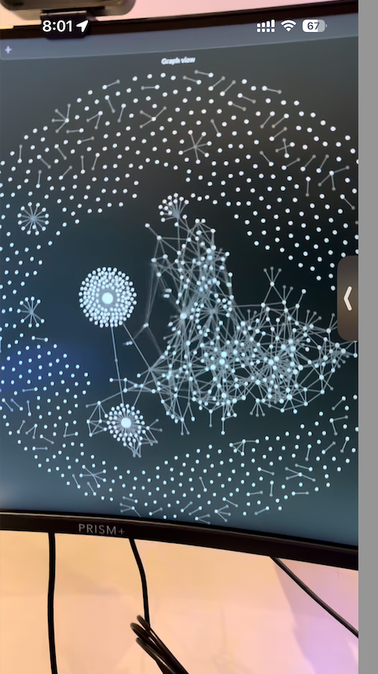
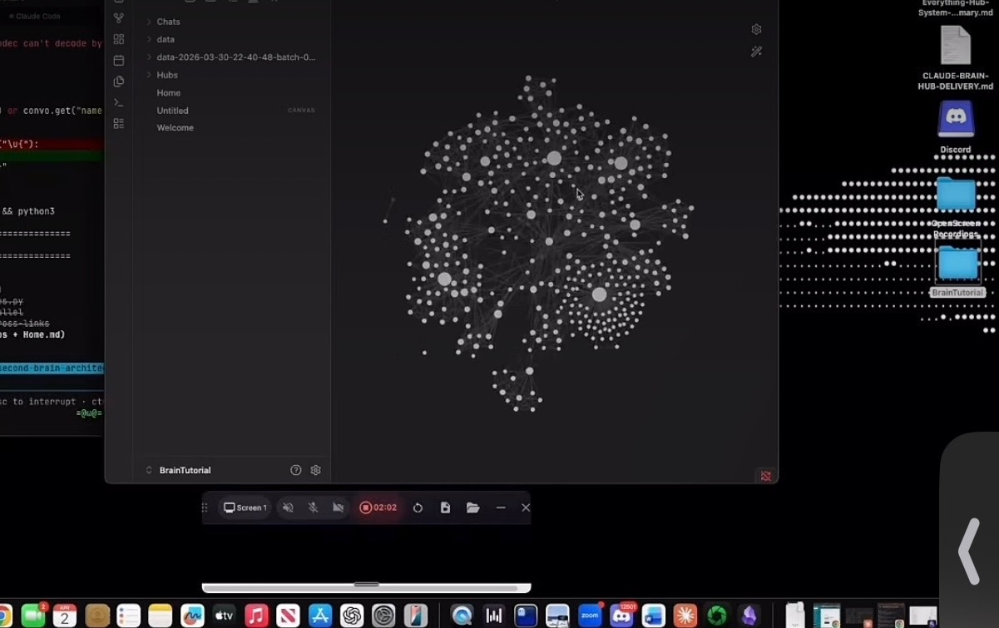

# Inspiration Board

Saved websites for layout ideas, color schemes, and design reference.

**How to add:** Tell Claude Code "save this site to my inspiration board" with the URL and what you like about it. Or drop screenshots into `inspiration/screenshots/` and list them below.

---

## Sites

<!-- Add new entries at the top -->

### Gucci Monogram Pattern
- **Source:** Reference image (gucci wallpaper)
- **Category:** ui-component, color-scheme
- **What I like:** Interlocking logo repeat pattern on tan/beige background with diamond grid lattice connecting the monograms. Classic luxury brand pattern. Use the buffalo nickel logo from Coin Show Near Me as a micro icon and create a similar repeating monogram pattern — could work as a subtle background texture, hero overlay, or section divider on the site.
- **For project:** Coin Shows
- **Screenshot:** 

### WorkMatrixx (MAVIS)
- **URL:** https://workmatrixx.com/
- **Category:** landing-page, layout, color-scheme, dashboard
- **What I like:** Dark mode SaaS landing page with teal/cyan accent. "Operations Graph" visualization showing connected workflows (Sales Follow-up, Inbox triage, CRM update, Calendar sync, Client support, Reporting) all flowing through a central hub. Feature cards with mini UI previews (inbox triage, lead follow-up sequences, calendar booking, CRM pipeline stages, client support escalation). Clean typography with bold italic headings. Very relevant — MAVIS is an AI operator that handles recurring business work across departments with human escalation. Similar concept to what we're building with the FCBF chatbot + EspoCRM automation.
- **For project:** Dashboard, FCBF, General
- **Screenshots:**
  - 
  - 

### Second Brain — Obsidian Graph View
- **Source:** Instagram reel (BrainTutorial vault built with Claude Code)
- **Category:** dashboard, ui-component
- **What I like:** Every note is a dot, every link between notes is a line. Clusters form around related topics. You can see your whole knowledge base as an interactive map — zoom in on a cluster to explore, click a node to open it. This is the visual model for a "Brain" tab in the dashboard where businesses, ideas, contacts, and projects all connect.
- **For project:** Dashboard, General
- **Built with:** Obsidian (Graph View feature)
- **Screenshots:** 
  - 
  - 

### I Care Air Care
- **URL:** https://www.icareaircare.com/
- **Category:** landing-page, layout
- **What I like:** Clean local service business layout. Built with Astro. Strong review integration (700+ Google reviews inline), clear service cards, prominent phone CTA, team photos, 3-step process section, FAQ accordion. Good example of a local service business site done right.
- **For project:** E-Waste, Local Services, General
- **Built with:** Astro
- **Creator:** Will Hamilton (advise)

### Nomads.com (formerly Nomad List)
- **URL:** https://www.nomads.com
- **Category:** layout, dashboard, ui-component
- **What I like:** Directory-style layout with filterable grid/list/map views. Massive filter system with categories. Card-based city listings with scores, cost, internet speed. Dark mode. Data-rich without feeling cluttered. Good model for any directory site.
- **For project:** Coin Shows, Local Services, General
- **Built with:** Custom (by Pieter Levels)

<!-- TEMPLATE:
### Site Name
- **URL:** https://example.com
- **Category:** layout / color scheme / typography / UI component / landing page / dashboard
- **What I like:** description of what caught your eye
- **For project:** FCBF / DSI / Coin Shows / E-Waste / Dashboard / General
- **Screenshot:** 
-->

---

## Categories

| Tag | Use for |
|---|---|
| layout | Page structure, grid, spacing |
| color-scheme | Color palettes, gradients, dark/light mode |
| typography | Font pairings, heading styles |
| ui-component | Buttons, cards, forms, navbars |
| landing-page | Full landing page designs |
| dashboard | Admin panels, data displays |
| email | Newsletter and email template designs |
| mobile | Mobile-first designs |
